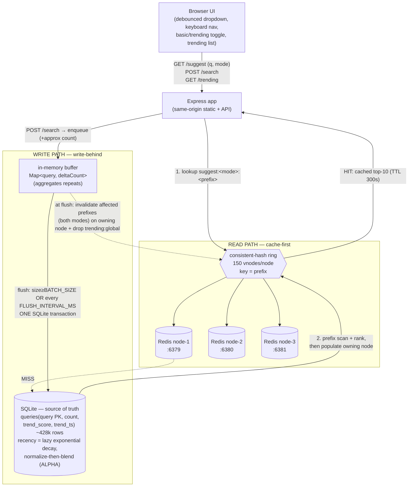

# Search Typeahead System

A search **typeahead / autocomplete** service: as the user types, it returns the most relevant
query completions for that prefix, ranked either by all-time popularity (`basic`) or by a
recency-aware blend (`trending`). It is backed by a SQLite source of truth (~428k real
word/phrase frequencies), fronted by a distributed cache of 3 Redis nodes addressed through an
**app-layer consistent-hashing ring**, and fed by a **write-behind batch writer** that records
searches efficiently. A small zero-build web UI demonstrates the live dropdown, keyboard
navigation, a basic↔trending toggle, and a trending list.

---

## Architecture



**Read path:** `GET /suggest` checks the owning Redis node (chosen by the ring) for
`suggest:<mode>:<prefix>`. On a **hit** it returns the cached top-10; on a **miss** it queries
SQLite, ranks the result, and populates that node (with a 300 s TTL safety-net).

**Write path:** `POST /search` does **not** write to SQLite directly — it enqueues into an
in-memory buffer that aggregates repeated queries. A flush (on size **or** timer) writes the
whole batch in **one transaction**, then invalidates the affected prefixes (both modes) on
their owning Redis nodes and drops the cached global trending list.

**Freshness:** TTL + explicit invalidation together. **Trending:** a separate recency signal
per query with lazy exponential decay, blended with all-time count.

---

## Tech stack

| Component | Choice | One-line rationale |
|-----------|--------|--------------------|
| Runtime / HTTP | **Node.js + Express** | single-threaded model pairs cleanly with synchronous SQLite; minimal, well-understood |
| Source of truth | **SQLite via better-sqlite3** | file-backed, real transactions, synchronous API — zero external service for a single-node demo |
| Cache | **3 independent Redis nodes + app-layer Ketama ring (150 vnodes)** | implements *consistent hashing* explicitly — **not** Redis Cluster (which is fixed CRC16 slot sharding, not consistent hashing) |
| Frontend | **Vanilla static HTML/CSS/JS** (no build step) | keeps focus on the backend/system design; served same-origin so there is no CORS to configure |

See **[DESIGN.md](DESIGN.md)** for the full choice / alternative / trade-off breakdown.

---

## Prerequisites

- **Node.js 18+** (uses the global `fetch`)
- **Docker Desktop** (for the 3 Redis nodes)

## Setup & run (in this exact order)

```bash
# 1. Start the 3 Redis cache nodes (ports 6379/6380/6381)
docker compose up -d
docker ps                 # verify 3 containers are Up

# 2. Install dependencies
npm install

# 3. Ingest the dataset into SQLite (~428k rows; idempotent)
npm run load-data

# 4. Start the server
npm start                 # -> http://localhost:3000
```

Open <http://localhost:3000> and start typing. Copy `.env.example` to `.env` to tune any knob
(see that file for every variable and its default).

---

## Dataset

- **Source:** Peter Norvig's n-gram frequency lists — `count_1w.txt` (≈333k unigrams) plus the
  **top 100,000** bigrams from `count_2w.txt`. These are derived from Google's *Web Trillion
  Word Corpus*.
- **Ingest (`npm run load-data`):** normalizes every entry (lowercase + trim), de-duplicates on
  the `query` PRIMARY KEY so re-running is **idempotent**, and scales counts as
  `max(1, floor(raw / 1000))` so that later `+1` search increments stay visible against the
  original magnitudes.
- **Offline fallback:** if the files are unreachable, the loader generates a **150k-row
  power-law synthetic** dataset so the build still works offline. The loader logs which path it
  used.
- **Honest caveat:** these are **web word/phrase frequencies** (keywords / text-with-counts),
  not literal logged search queries. Section 3 of the assignment explicitly permits using such
  an open dataset of "queries/keywords with a count"; the power-law shape of word frequencies is
  a realistic stand-in for search popularity.

---

## npm scripts

| Script | Command | What it proves / does |
|--------|---------|------------------------|
| start | `npm start` | boots the Express server + write-behind timer on `http://localhost:3000` |
| load-data | `npm run load-data` | downloads + ingests the dataset (~428k rows) into SQLite |
| ring-demo | `npm run ring-demo` | consistent hashing: balanced ~33%/node and only ~1/4 keys remap when a node is added |
| trending-demo | `npm run trending-demo` | basic vs trending before/after a surge, and recency decaying over time |
| batch-demo | `npm run batch-demo` | write reduction (searches → far fewer upserts/txns) + the crash-loss window |
| perf | `npm run perf` | real `/suggest` p50/p95/p99 (hit vs miss), skewed-load hit rate, write reduction (requires the server running) |

---

## API

Base URL: `http://localhost:3000`

| Method | Path | Params / body | Notes |
|--------|------|---------------|-------|
| GET | `/suggest` | `q=<prefix>`, `mode=basic\|trending` (default `trending`) | top-10 completions for the prefix |
| POST | `/search` | JSON `{ "query": "..." }` | records a search (write-behind); returns approximate count |
| GET | `/trending` | — | global hot list by decayed recency |
| GET | `/cache/debug` | `prefix=<p>`, `mode=basic\|trending` (default `trending`) | which node owns the prefix + current hit/miss (read-only) |
| GET | `/cache/stats` | — | hits, misses, hit rate, `dbReads`, per-node counters |
| GET | `/batch/stats` | — | searchesEnqueued, flushes, txns, dbUpserts, buffered, reductionRatio |
| POST | `/batch/flush` | — | force a flush (admin / demo / deterministic tests) |
| GET | `/health` | — | `{ "status": "ok" }` |

### Examples

> Response **values** below are illustrative of the JSON *shape* — actual counts/scores depend
> on the loaded dataset and how many searches have happened. (Measured performance figures live
> in [PERFORMANCE.md](PERFORMANCE.md).)

```bash
# Suggestions (default trending mode)
curl "http://localhost:3000/suggest?q=new"
# {"prefix":"new","mode":"trending","suggestions":[{"query":"new","count":1551258}, ...]}

# Basic (all-time count) mode
curl "http://localhost:3000/suggest?q=new&mode=basic"

# Record a search
curl -X POST http://localhost:3000/search \
  -H "Content-Type: application/json" -d '{"query":"new york"}'
# {"message":"Searched","query":"new york","count":42}

# Trending hot list
curl "http://localhost:3000/trending"
# {"trending":[{"query":"new york","score":12.0}, ...]}

# Which node owns a prefix, and is it cached?
curl "http://localhost:3000/cache/debug?prefix=new&mode=trending"
# {"prefix":"new","mode":"trending","node":"node-2","status":"hit"}

# Cache + DB-read stats
curl "http://localhost:3000/cache/stats"
# {"hits":..,"misses":..,"hitRate":..,"dbReads":..,"perNode":{...}}

# Batch writer stats / manual flush
curl "http://localhost:3000/batch/stats"
curl -X POST "http://localhost:3000/batch/flush"

# Health
curl "http://localhost:3000/health"   # {"status":"ok"}
```

---

## Project structure

```
.
├── config.js               # all config (env-backed defaults) — see .env.example
├── docker-compose.yml      # 3 independent redis:7-alpine nodes (6379/6380/6381)
├── src/
│   ├── server.js           # boot: listen, start batch writer, graceful-shutdown flush
│   ├── app.js              # Express app: static frontend + mounted routes
│   ├── db/db.js            # SQLite connection, schema, idempotent migration
│   ├── routes/             # suggest, search, trending, cacheDebug, batch
│   ├── services/
│   │   ├── suggestionService.js  # read path: basic + trending ranking, cache-first
│   │   ├── searchService.js      # write path entry: normalize -> enqueue
│   │   └── batchWriter.js        # write-behind buffer, aggregation, flush, counters
│   ├── cache/
│   │   ├── hashRing.js     # ConsistentHashRing (md5 -> ring, 150 vnodes)
│   │   └── cacheClient.js  # 3 Redis clients via the ring, counters, graceful degradation
│   └── utils/              # normalize.js (shared read/write normalization), recency.js (decay)
├── scripts/                # loadData, ringDemo, trendingDemo, batchDemo, perfBench
├── public/                 # index.html, styles.css, app.js (zero-build frontend)
└── data/                   # SQLite file + downloaded dataset (gitignored)
```

---

## Performance

Measured locally with `npm run perf`: `/suggest` p95 ≈ **3.7 ms** on a cache hit vs ≈ **42.7 ms**
on a DB-backed miss; **99.4%** hit rate under a Zipf-skewed workload; write-behind batching turns
5000 searches into **11 transactions** (≈455× fewer). Full numbers, methodology, and the
consistent-hashing remap evidence are in **[PERFORMANCE.md](PERFORMANCE.md)**.

## Design choices

The reasoning behind every major decision — cache-first reads, SQLite as source of truth,
key-value cache vs trie, consistent hashing vs Redis Cluster/modulo, TTL + invalidation,
graceful degradation, trending (lazy decay + normalize-then-blend), and write-behind batching vs
sampling — with alternatives and trade-offs, is in **[DESIGN.md](DESIGN.md)**.

## Screenshots / demo

> Images live in [`docs/screenshots/`](docs/screenshots/). The two DevTools captures below show the
> **same prefix** (`anshul`) on a **cold cache** vs a **warm cache** — the clearest way to see what the
> Redis layer actually buys you.

### 1. Live UI — suggestions, recency toggle & trending

![Search Typeahead UI]

The full single-page UI: a debounced suggestion dropdown, the **Recency-aware ranking** toggle
(ON = `trending` mode, OFF = `basic` all-time-count mode), the inline **Searched** confirmation, and
the live **TRENDING** list ranked by decayed recency. Trending only fills in *after* real searches are
recorded and flushed by the write-behind writer (a fresh DB with zero searches shows an empty list),
and it auto-refreshes every ~20 s.

### 2. Cold cache (cache **MISS**) — slower, DB-backed

![Cache miss in the Network tab]


Typing `anshul` for the **first time**. Each new prefix (`ansh`, `anshu`, `anshul`) is **not in Redis
yet**, so every `/suggest` is a **cache miss**: the server falls back to SQLite, runs a prefix scan +
ranking, and *then* populates the owning Redis node (chosen by the consistent-hash ring). In the
Network panel these land at **~35–38 ms** each. Contrast the `/trending` request at **~5 ms** — that
one was already cached, i.e. a hit. This is the expensive path: one disk-backed query + rank per
uncached prefix.

### 3. Warm cache (cache **HIT**) + frontend debounce — faster

![Cache hit in the Network tab]


Typing the **same** `anshul` again. Two optimizations are visible at once:

- **App-layer cache hit:** the prefix now lives in Redis, so `/suggest` skips the SQLite scan entirely
  and returns the pre-ranked top-10 straight from the owning node — the heavy DB work from screenshot
  #2 is gone.
- **Frontend efficiency:** the 180 ms debounce + an `AbortController` cancel the in-flight intermediate
  requests (the **`(canceled)`** rows for `ansh` / `anshu`), so only the final prefix actually resolves;
  the repeat request returns **`304 Not Modified`** at just **0.2 kB** — nothing is re-downloaded.

### Caching latency, in one line

A **cache hit** serves a pre-ranked list straight from Redis memory (single-digit ms — p95 ≈ **3.7 ms**),
while a **cache miss** pays for a SQLite prefix-scan + ranking (tens of ms — p95 ≈ **42.7 ms**, and the
**~35–38 ms** observed above). So the more a prefix is searched, the warmer it stays in Redis and the
faster it gets; cold or rare prefixes are the slow ones — and with Redis switched off entirely, *every*
lookup takes the miss path. Full methodology and numbers are in [PERFORMANCE.md](PERFORMANCE.md).
